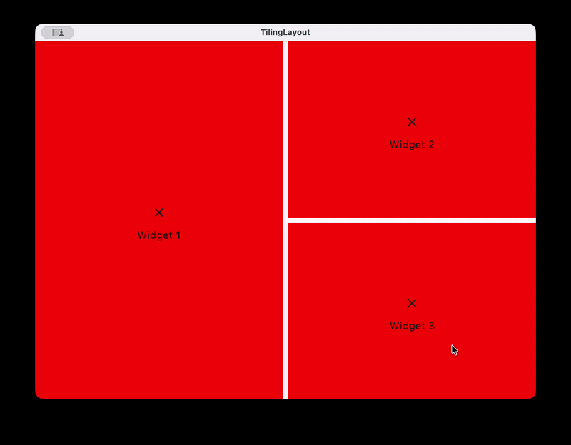

# TilingLayout

A **Compose Multiplatform** layout that arranges content as a tree of recursive horizontal and vertical splits — like a tiling window manager, but for Compose UI.



---

## Supported platforms

| Platform | Target |
|---|---|
| Android | minSdk 24 |
| iOS | iosX64 · iosArm64 · iosSimulatorArm64 |
| JVM / Desktop | Compose for Desktop |
| JS | Kotlin/JS (browser) |
| WasmJS | Kotlin/Wasm (browser) |

---

## Installation

The library is published on [JitPack](https://jitpack.io).

Add the JitPack repository to your project's `settings.gradle.kts`:

```kotlin
dependencyResolutionManagement {
    repositories {
        // ...
        maven("https://jitpack.io")
    }
}
```

Then add the dependency in your module's `build.gradle.kts`:

```kotlin
commonMain.dependencies {
    implementation("com.github.sbusceti.TilingLayout:tilinglayout:1.0.0")
}
```

---

## Quick start

### DSL overload — static layouts

Use the builder DSL when the pane structure is fixed at composition time:

```kotlin
TilingLayout {
    hSplit {
        leaf { LeftPane() }
        vSplit {
            leaf { TopRightPane() }
            leaf { BottomRightPane() }
        }
    }
}
```

Each `hSplit` / `vSplit` requires **exactly 2 children**. The optional `ratio` parameter controls the initial size of the first child (default `0.5f`):

```kotlin
hSplit(ratio = 0.3f) {
    leaf { NarrowSidebar() }
    leaf { WideContent() }
}
```

### Node overload — dynamic layouts

For layouts driven by runtime state (adding, removing, or rearranging panes), pass a `TilingNode` tree directly and handle mutations yourself:

```kotlin
var node by remember { mutableStateOf<TilingNode>(TilingNode.Leaf("main")) }

TilingLayout(node = node) { id ->
    Pane(
        title = id,
        onClose = { node = node.removeLeaf(id) },
    )
}
```

---

## TilingNode tree

`TilingNode` is an **immutable sealed class** that describes the pane layout as a binary tree.

| Node | Description |
|---|---|
| `Leaf(id)` | A terminal pane. `id` links it to its composable content. |
| `HSplit(leftNode, rightNode, ratio)` | Two panes side by side. `ratio` is the left pane's fraction of the total width. |
| `VSplit(topNode, bottomNode, ratio)` | Two panes stacked. `ratio` is the top pane's fraction of the total height. |
| `EmptyNode` | An empty layout — useful as the initial state before any pane is added. |

### Tree operations

All operations return a **new tree**; the original is never mutated.

```kotlin
// Remove a pane — its sibling takes the freed space
node = node.removeLeaf(id)

// Add a pane adjacent to an existing one
node = node.addLeaf(
    id = "new-pane",
    splitArea = SplitArea.Right,  // Top | Bottom | Left | Right
    leafDestId = "existing-pane", // null = wrap the whole tree
)

// Swap the positions of two panes (structure and ratios unchanged)
node = node.swapLeaves(srcId, destId)

// Collect all leaf IDs in depth-first order
val ids: List<String> = node.leafIds()
```

---

## Draggable dividers

Every split renders a draggable Material3 divider between its two children. Dragging it updates the split ratio at runtime **without modifying the `TilingNode` tree** — the overridden ratios are kept in internal state and tied to each split's auto-generated `id`.

Divider appearance is controlled via `GapDefaults`:

```kotlin
TilingLayout(
    node = node,
    gap = GapDefaults(
        thickness = 8.dp,
        color = Color.Transparent, // invisible by default
    ),
) { id -> /* ... */ }
```

The cursor changes to a resize icon on hover (desktop and web targets).

---

## Example: ViewModel-driven layout (MVI)

Define your state, actions, and ViewModel following the MVI pattern:

```kotlin
// State
data class LayoutState(
    val node: TilingNode = TilingNode.EmptyNode,
)

// Actions
sealed interface LayoutAction {
    data class RemovePane(val paneId: String) : LayoutAction
    data class AddPane(val paneId: String, val area: SplitArea, val targetId: String) : LayoutAction
}

// ViewModel
class LayoutViewModel : ViewModel() {
    private val _state = MutableStateFlow(
        LayoutState(
            node = TilingNode.HSplit(
                leftNode = TilingNode.Leaf("editor"),
                rightNode = TilingNode.Leaf("preview"),
            )
        )
    )
    val state = _state.asStateFlow()

    fun onAction(action: LayoutAction) {
        when (action) {
            is LayoutAction.RemovePane -> {
                _state.update { it.copy(node = it.node.removeLeaf(action.paneId)) }
            }
            is LayoutAction.AddPane -> {
                _state.update { it.copy(node = it.node.addLeaf(action.paneId, action.area, action.targetId)) }
            }
        }
    }
}
```

Wire the ViewModel to your composable:

```kotlin
@Composable
fun LayoutScreen(viewModel: LayoutViewModel = koinViewModel()) {
    val state by viewModel.state.collectAsState()
    LayoutScreenContent(state = state, onAction = viewModel::onAction)
}

@Composable
fun LayoutScreenContent(
    state: LayoutState,
    onAction: (LayoutAction) -> Unit,
) {
    TilingLayout(node = state.node) { id ->
        Pane(
            onClose = { onAction(LayoutAction.RemovePane(id)) },
            onSplit = { area, newId -> onAction(LayoutAction.AddPane(newId, area, id)) },
        )
    }
}
```

---

## License

[Apache 2.0](LICENSE)

---

> This library was built as a final project for the [Compose Multiplatform](https://kt.academy) course on **kt.academy**.
